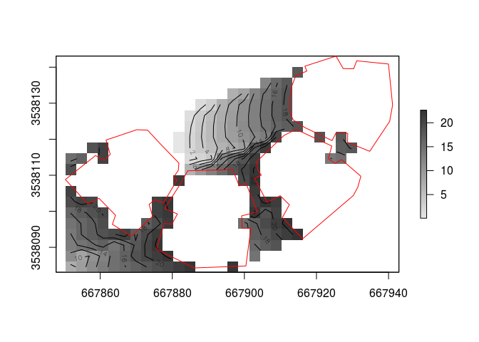

<!-- README.md is generated from README.Rmd. Please edit that file -->
### Installation

``` r
install.packages("devtools")
devtools::install_github("michaeldorman/shadow")
```

### Quick demo

``` r
library(shadow)
#> Loading required package: sp
library(sp)
library(rgeos)
#> rgeos version: 0.3-22, (SVN revision 544)
#>  GEOS runtime version: 3.5.1-CAPI-1.9.1 r4246 
#>  Linking to sp version: 1.2-4 
#>  Polygon checking: TRUE
library(raster)

# Single location
ctr = gCentroid(rishon)
plot(rishon)
plot(ctr, add = TRUE)
sun = shadow:::.sunLocation(
  location = ctr, 
  sun_az = 30, 
  sun_elev = 20
  )
sun_ray = ray(from = ctr, to = sun)
build_outline = as(rishon, "SpatialLinesDataFrame")
inter = gIntersection(build_outline, sun_ray)
plot(sun_ray, add = TRUE, col = "yellow")
plot(inter, add = TRUE, col = "red")
```


``` r
shadowHeight(
  location = ctr, 
  obstacles = rishon, 
  obstacles_height_field = "BLDG_HT", 
  solar_pos = matrix(c(30, 20), nrow = 1, ncol = 2)
  )
#> Assuming BLDG_HT given in m
#>          [,1]
#> [1,] 10.31931
```

``` r
# Grid
ext = as(extent(rishon), "SpatialPolygons")
r = raster(ext, res = 3)
proj4string(r) = proj4string(rishon)
grid = rasterToPoints(r, spatial = TRUE)
grid = SpatialPointsDataFrame(grid, data.frame(id = 1:length(grid)))

library(parallel)
start = Sys.time()
shadeheights = mclapply(
  split(grid, grid$id),
  shadowHeight,
  obstacles = rishon, 
  obstacles_height_field = "BLDG_HT", 
  solar_pos = matrix(c(70, 30), nrow = 1, ncol = 2),
  mc.cores = 3
  )
end = Sys.time()
end - start
#> Time difference of 3.699326 secs
r[] = simplify2array(shadeheights)

plot(r, col = grey(seq(0.9, 0.2, -0.01)))
contour(r, add = TRUE)
plot(rishon, add = TRUE, border = "red")
```



### To-do list

-   Raster support (as `location`)

-   Restrict `shadowHeight` calculations only within `shadeFootprint` result

-   `height` input for `shadowFootprint`

-   Raster support (as `surface`)

-   `parallel` support

-   New vignette

### Ideas for future development
