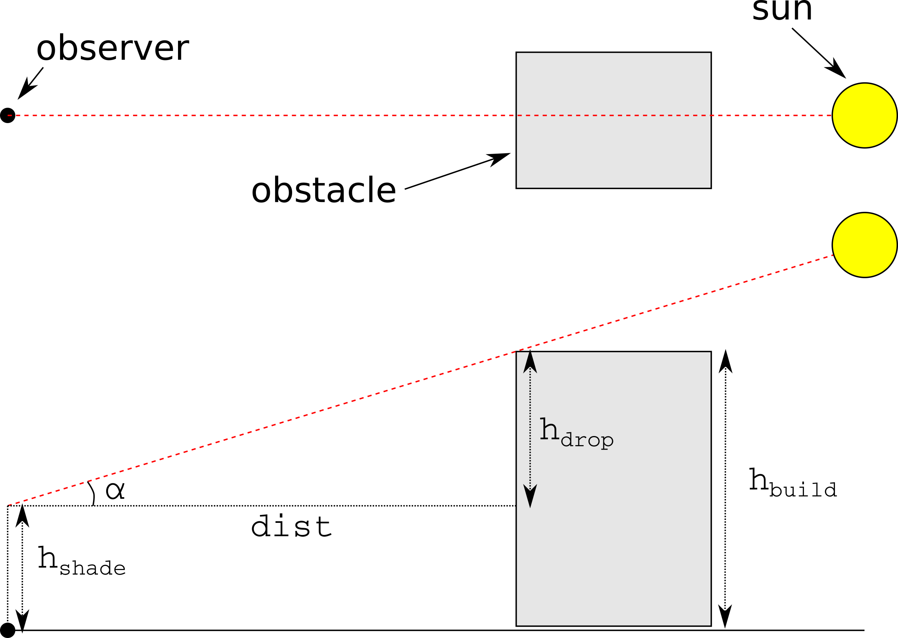

```{r, echo = FALSE}
knitr::opts_chunk$set(
  fig.align = "center",
  collapse = TRUE, 
  comment = "#>"
  )
set.seed(1014)
# options(dplyr.print_max = 10)
```

# Introduction

Spatial analysis of the urban environment frequently requires estimating *shading*. For example -

* The amount of time a given point / roof / facade is shaded may determine the utility of installing Photo-Voltaic cells for electricity production

* The Sky View Factor (SVF) of a given street is associated with its microclimate

* Calculating shade footprint on a green park helps urban planners provide guidelines for maximal height of a new building

These types of calculations (and more advanced ones) are usually restricted to proprietary software dealing with 3D models, such as ESRI's ArcScene. Terrain-based solutions (i.e. Digital Elevation Model, DEM) are more common, in both open-source (GRASS GIS) as well as proprietary (ArcGIS) software. The `insol` R package [@insol] provides such capabilities in R. However terrain-based approaches may not be appropriate for an urban environment, for two reasons. First, a continuous elevation surface at the necessary resolution for the urban context (e.g. LIDAR) may not be available and is expensive to produce. Second, the DEMs cannot adequately represent individual urban elements such as *building facades*, thus limiting the interpretability of results. The `shadow` package aims at addressing these limitations. The `shadow` package operates on a *vector layer* of building outlines along with their heights, rather than a DEM. Such data are generally much more available, either from local municipalities or from global datasets such as OpenStreetMap. Therefore the resulting shade estimates correspond to urban environment such as individual buildings or facades. It should be noted that the approach assumes a flat terrain and no obstacles (e.g. trees) other than the buildings, which may be inappropriate in certain situations (e.g. a mountainous urban area). 

## Calculation

The functions currently included `shadow` are based on the trigonometric relations in the triangle defined by the sun rays, the ground (or plane parallel to the ground) and an obstacle. For example, as shown in Figure \@ref(fig:trigdrawing), shade height ($h_{shade}$) at a given location ($observer$) can be calculated based on the sun elevation angle ($\alpha$) in case there is one obstacle with a known height ($h_{build}$) and at a known distance ($dist$) - 

$h_{shade} = h_{build} - dist * tan(\alpha)$

This approach can be expanded for the general case of multiple obstacles, in which case we must take the *maximum* value of all potential shade heights caused by the obstacles. 

```{r trigdrawing, fig.cap="Shade height calculation", out.width = "400px", echo=FALSE}

```

<!--  -->

# Functions

The `shadow` package currently contains three main functions, as well as several helper functions. The main functions give three distinct aspects of shading -

* The `shadeHeight` function calculates shade height at a single point; the wrapper `shadePropWall` gives the shaded fraction of a facade, by repeatedly calling `shadeHeight` on sample points along its length.

* The `shadeFootprint` function calculates the shade footprint on the ground, given the layer of obstacles and sun position.

* The `SVF` function calculates the Sky View Factor (SVF), which is a measure of sky proportion not obstructed to the viewer at a given point on the ground.

# Examples

Before going into the examples, we load the `shadow` package as well as packages `sp` (loaded automatically), `raster` and `rgeos` -

```{r, message=FALSE}
library(shadow)
library(raster)
library(rgeos)
```

In the examples we will use a polygonal layer representing four buildings (`build`) along having a height attribute (`BLDG_HT`) as shown on Figure \@ref(fig:buildings) -

```{r buildings, fig.cap="Sample buildings and heights"}
plot(build)
text(gCentroid(build, byid = TRUE), build$BLDG_HT)
```

## Shade height

The `shadeHeight` function calculates shade height at a given point location. For example, to calculate shade height at the centroid of the layer (`location`), on `2004-12-24 13:30:00` we first need to determine the sun elevation and azimuth at that time. This can be done with function `solarpos` from package `maptools` -

```{r}
location = gCentroid(build)
time = as.POSIXct("2004-12-24 13:30:00", tz = "Asia/Jerusalem")
location_geo = spTransform(location, "+proj=longlat +datum=WGS84")
solar_pos = maptools::solarpos(location_geo, time)
solar_pos
```

Now we know the sun azimuth (`r round(solar_pos[1,1], 1)`) and elevation (`r round(solar_pos[1,2], 1)`). Given sun position, the layer of obstacles and queried location, shade height can be calculated with `shadeHeight` -

```{r}
h = shadeHeight(location, build, "BLDG_HT", solar_pos)
h
```

Shade height at the queried point is `r round(h, 2)` meters. Note the warning regarding the units of the `BLDG_HT` attribute. The function has no way of knowing the height dimension units are the same as the Coordinate Reference System (CRS) spatial distance units. It is up to the user to make sure.

The following code and subsequent Figure \@ref(fig:ray) illustrate how the calculation is carried out. First, a line of sight `ray` is drawn between the point of interest `location` and the sun position based on its azimuth `sun_az`. Potential intersections `inter` are then detected. Finally, the shade height induced by each intersection is calculated based on the distance to intersection, sun elevation `sun_elev` and building height. The final result is the maximum value of these potential heights.

```{r ray, fig.cap="Shade height at a single location", message=FALSE}
sun = shadow:::.sunLocation(
  location = location, 
  sun_az = solar_pos[1, 1], 
  sun_elev = solar_pos[1, 2]
  )
sun_ray = ray(from = location, to = sun)
build_outline = as(build, "SpatialLinesDataFrame")
inter = gIntersection(build_outline, sun_ray)
plot(build)
text(gCentroid(build, byid = TRUE), build$BLDG_HT)
plot(location, add = TRUE)
text(
  location, 
  round(shadeHeight(location, build, "BLDG_HT", solar_pos), 2), 
  pos = 3
  )
plot(sun_ray, add = TRUE, col = "yellow")
plot(inter, add = TRUE, col = "red")
```

## Calculating shade height for each point

The procedure can be readily expanded to calculate a continuous surface of shade heights. To make it faster, we can use `mclapply` from package `parallel` or any other parallelization solution. 

First, we will create a grid covering the examined area with a spatial resolution of 2 meters - 

```{r}
ext = as(extent(build) + 50, "SpatialPolygons")
r = raster(ext, res = 2)
proj4string(r) = proj4string(build)
grid = rasterToPoints(r, spatial = TRUE)
grid = SpatialPointsDataFrame(
  grid,
  data.frame(grid_id = 1:length(grid))
  )
```

The following code section plots the input grid (Figure \@ref(fig:heightgrid)).

```{r heightgrid, fig.cap="Input grid for creating a shade heights surface"}
plot(grid, pch = ".")
plot(build, add = TRUE)
```

Calculating shade height at each point, using package `parallel` -

```{r, eval=FALSE}
library(parallel)
shade_heights = mclapply(
  split(grid, grid$grid_id),
  shadeHeight,
  build, "BLDG_HT", solar_pos,
  mc.cores = 3
  )
grid$shade_height = simplify2array(shade_heights)
```

```{r, echo=FALSE}
grid$shade_height = NA
for(i in 1:length(grid)) {
  grid$shade_height[i] = 
    shadeHeight(grid[i, ], build, "BLDG_HT", solar_pos, messages = FALSE)
}
```


The resulting grid can be converted to a `RasterLayer` object of shade heights and plotted with following code section (Figure \@ref(fig:heightresult)). Note the partial shade on the roof of the 19.07-m building which is caused by the slightly taller 22.73-m building.

```{r heightresult, fig.cap="Shade height (m) grid", fig.height=5.5}
shade = as(grid, "SpatialPixelsDataFrame")
shade = raster(shade, layer = "shade_height")
plot(shade, col = grey(seq(0.9, 0.2, -0.01)))
plot(shade, col = grey(seq(0.9, 0.2, -0.01)))
contour(shade, add = TRUE)
plot(build, add = TRUE, border = "red")
text(gCentroid(build, byid = TRUE), build$BLDG_HT)
```

## Shade footprint

The `shadeFootprint` function calculates the geometry of shade projection on the ground, rather than its height at discrete sampling points. The resulting layer can be used to calculate the proportion of shaded surface out of a defined area, to examine which building shades a given element, etc. 

For example, suppose a playground is being built in vicinity to the four buildings in `build`, as shown on Figure \@ref(fig:park).

```{r park, fig.cap="Park location"}
park_location = raster::shift(location, y = 20, x = -8)
park = rgeos::gBuffer(park_location, width = 12)
plot(build)
text(gCentroid(build, byid = TRUE), build$BLDG_HT)
plot(park, col = "lightgreen", add = TRUE)
```

```{r, echo=FALSE}
time2 = as.POSIXct("2004-06-24 09:30:00", tz = "Asia/Jerusalem")
solar_pos2 = maptools::solarpos(location_geo, time2)
footprint = shadeFootprint(build, "BLDG_HT", solar_pos2)
park_shade = gIntersection(park, footprint)
shade_prop = gArea(park_shade) / gArea(park)
```

Using `shadeFootprint` we can determine to what extent the palyground is shaded at a given time. For example, sun position at `r time2` is (`r round(solar_pos2, 1)`). The corresponding park shade proportion can be calculated by intersecting the shade footprint with park area and calculating the ratio. The result is `r scales::percent(shade_prop)`. 

```{r}
time2 = as.POSIXct("2004-06-24 09:30:00", tz = "Asia/Jerusalem")
solar_pos2 = maptools::solarpos(location_geo, time2)
solar_pos2
footprint = shadeFootprint(build, "BLDG_HT", solar_pos2)
park_shade = gIntersection(park, footprint)
shade_prop = gArea(park_shade) / gArea(park)
shade_prop
```

The following code section graphically demonstrates the resulting shaded proportion (Figure \@ref(fig:footprint)).

```{r footprint, fig.cap="Shade footprint at 2004-06-24 09:30:00"}
plot(footprint,  col = adjustcolor("lightgrey", alpha.f = 0.5))
plot(build, col = "darkgrey", add = TRUE)
plot(park, col = "lightgreen", add = TRUE)
plot(park_shade, col = adjustcolor("darkgreen", alpha.f = 0.5), add = TRUE)
text(gCentroid(park_shade), round(shade_prop, 2))
```

The calculation can be repeated for a sequence of times, rather than a single one, to monitor the daily (monthly, annual) course of shade proportions. For example, the following code creates a matrix `solar_pos_seq` which represents the sun positions course on `2004-06-24` at hourly intervals -

```{r}
time_seq = seq(
  from = as.POSIXct("2004-06-24 03:30:00", tz = "Asia/Jerusalem"),
  to = as.POSIXct("2004-06-24 22:30:00", tz = "Asia/Jerusalem"),
  by = "1 hour"
)
solar_pos_seq = maptools::solarpos(location_geo, time_seq)
solar_pos_seq
```

Using a `for` loop over `solar_pos_seq`, the following code section calculates the vector of park shade proportions over the entire day. Note the two conditional statements: (1) shade proportion is maximal (i.e. 1) when sun is below the horizon and (2) shade proportion is minimal (i.e. 0) when no intersections are detected between the park and the shade footprint. 

```{r}
shade_props = rep(NA, nrow(solar_pos_seq))
for(i in 1:nrow(solar_pos_seq)) {
  if(solar_pos_seq[i, 2] < 0)
    shade_props[i] = 1 else {
      footprint = 
        shadeFootprint(
          build, 
          "BLDG_HT", 
          solar_pos_seq[i, , drop = FALSE]
          )
    park_shade = gIntersection(park, footprint)
    if(is.null(park_shade))
      shade_props[i] = 0
    else
      shade_props[i] = gArea(park_shade) / gArea(park)
    }
}
```

Figure \@ref(fig:timeseries) summarizes the temporal variation in park shade proportion over the chosen day. The individual value we manually calculated in a previous step (`r time2`) is highlighted in red.

```{r timeseries, fig.cap="Shaded park proportion on 2004-06-24"}
plot(
  time_seq, 
  shade_props, 
  xlab = "Time", 
  ylab = "Shade proportion", 
  type = "b"
  )
text(
  x = time_seq[7], y = shade_props[7], 
  label = round(shade_props[7], 2), 
  pos = 4, col = "red"
  )
```

# References


